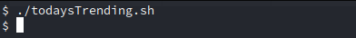
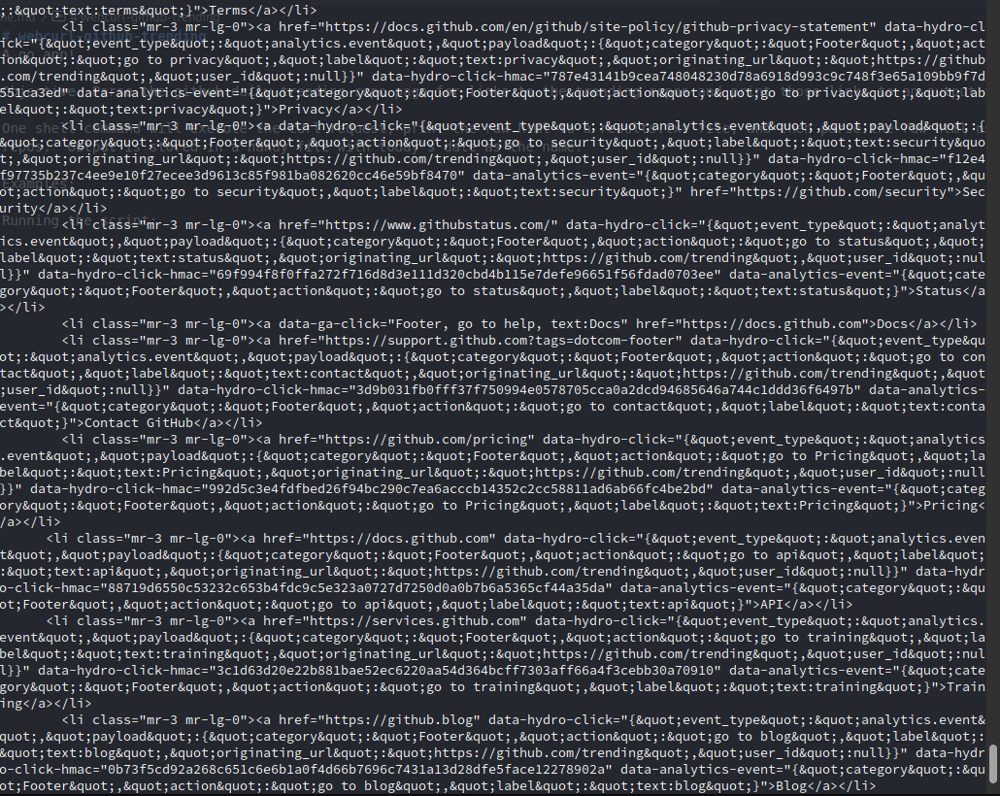
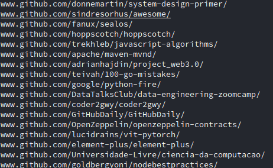

# webcurl-github-trending
## A go app!

Objective: Parse the github daily trending repo page for links to the trending repos and print those links to an output file.

One shell command will execute the curl request, print the raw html to a results.txt file, and then parse the raw html using go to print only the links to the day's trending repos.  Output is stored in a handy file with today's date as the name.

## Examples:

Running the script:

Webcurl output in results.txt (7000+ lines of html):

Parsed results in new file (2021-12-30):

TODO: automate script to run daily, format output to include project description
